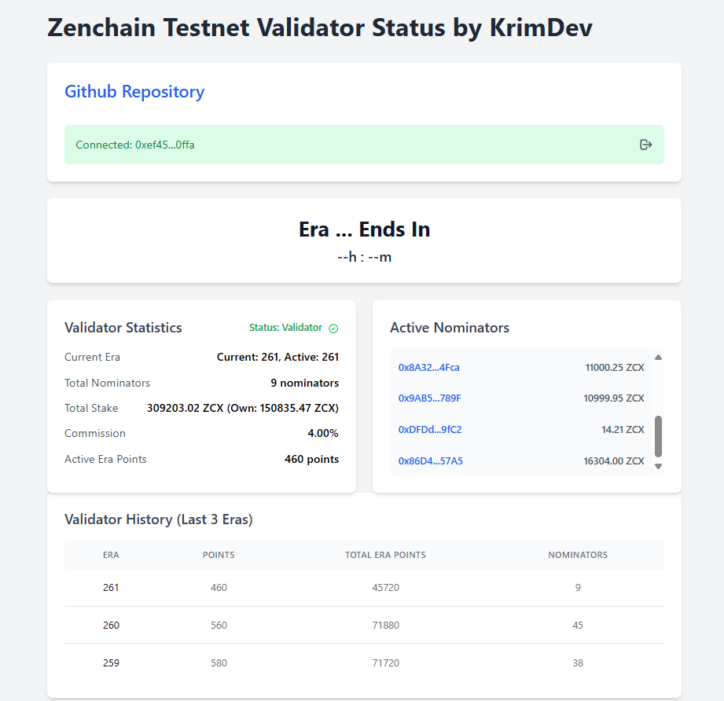

# Zenchain Testnet Validator Status

A web interface for monitoring Zenchain validators and staking operations. This tool provides real-time monitoring of validator status, nominator tracking, and staking management capabilities.




## Features

- Real-time validator statistics monitoring
- Active nominators tracking with stake amounts
- Staking operations (Bond, Bond Extra, Unbond)
- Auto-refresh of validator data
- MetaMask wallet integration
- Auto-reconnect functionality

## Installation

1. Clone the repository:
   ```bash
   git clone https://github.com/krimdev/zenchain-validator-status.git
   ```

2. Install dependencies:
   ```bash
   npm install
   ```

3. Configure your web server to serve the files.

## Usage

The interface provides:

- **Validator statistics** including:
  - Current and Active Era
  - Validator Status
  - Commission Rate
  - Total Stake
  - Active Nominators

- **Staking operations**:
  - Stake new tokens
  - Add to existing stake
  - Unbond tokens

## Tech Stack

- HTML/Tailwind CSS
- JavaScript
- ethers.js
- MetaMask wallet integration

## Features in Development

- Enhanced nominator analytics
- Historical performance tracking
- Advanced staking metrics

## Official Zenchain Links

- [Twitter](https://twitter.com/zenchain)
- [Telegram Announcements](https://t.me/zenchain_announcements)
- [Telegram Chat](https://t.me/zenchain_chat)
- [Technical Documentation](https://docs.zenchain.com)
- [ZenQuest](https://zenchain.com/zenquest)
- [Faucet](https://faucet.zenchain.com)
- [Node Station](https://nodestation.zenchain.com)
- [Explorer](https://explorer.zenchain.com)
- [Litepaper](https://zenchain.com/litepaper)
- [Discord](https://discord.com/invite/zenchain)

## Contributing

Pull requests are welcome. For major changes, please open an issue first to discuss what you would like to change.

## License

MIT
